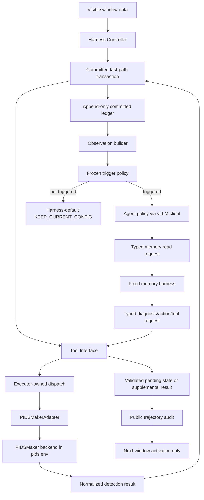
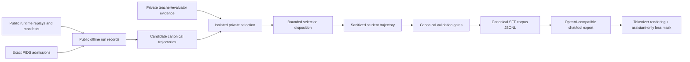
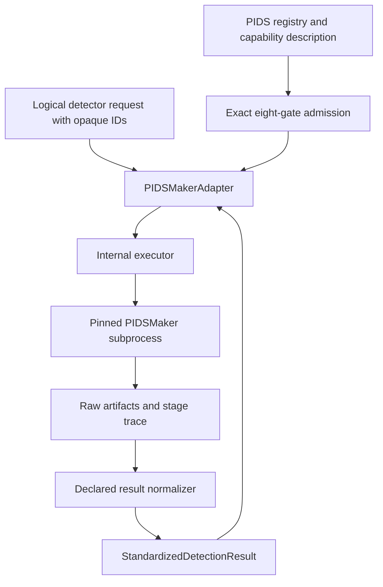
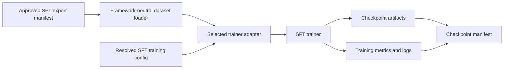
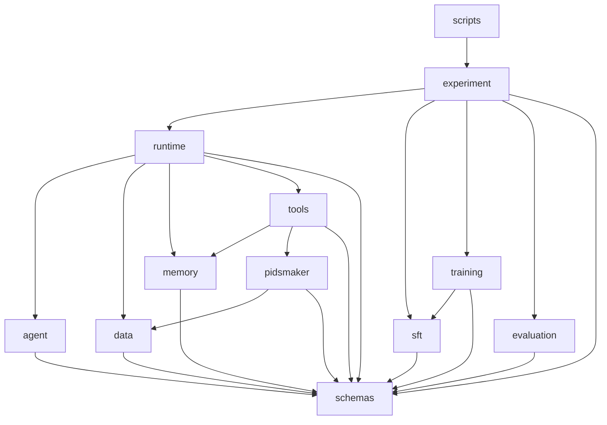
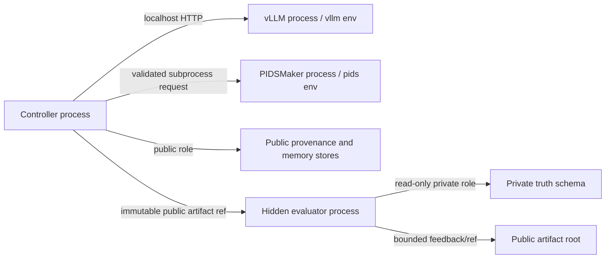
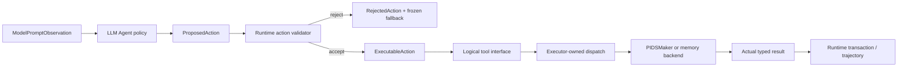
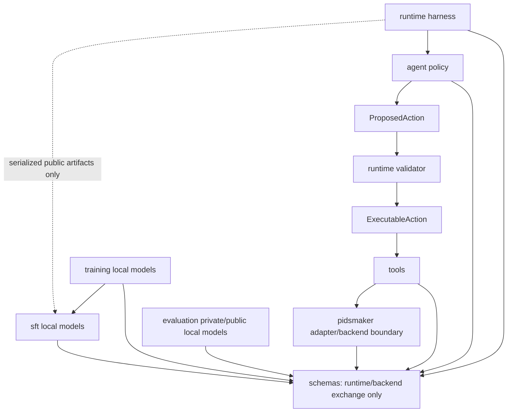

# APTDetectionAgent Project Architecture Design v1.1

Date: 2026-07-14  
Status: frozen repository architecture  
Scope: code organization, dependency boundaries, and Agent/runtime authority  
Requirement mapping: REQ-GOV-001..003, REQ-ENV-001..004,
REQ-CAUSAL-001..004, REQ-WINDOW-001..004, REQ-LABEL-001..004,
REQ-PIDS-001..006, REQ-TOOL-001..005, REQ-MEMORY-001..007,
REQ-EVAL-001..007, REQ-REPRO-001..003, REQ-SFT-001..010

## 0. Design position

This document raises the architecture discussion from the SFT Dataset Builder to
the complete APTDetectionAgent repository. It is the frozen engineering structure;
implementation remains incremental. Accepted behavior is also defined by:

1. `docs/design/APT_Detection_Agent_Design_v0.4.md`;
2. accepted ADRs under `docs/decisions/`;
3. `docs/AGENT_RUNTIME_CONTRACT_FREEZE.md`;
4. `docs/AGENT_TOOL_CAPABILITY_SPEC.md`;
5. `docs/PIDSMaker_FRAMEWORK_NOTE.md` and the pinned PIDSMaker submodule;
6. `docs/SFT_DATASET_DESIGN.md`;
7. `docs/SFT_DEMONSTRATION_CONSTRUCTION_PLAN.md`;
8. `docs/plans/REQUIREMENT_TRACEABILITY.md`.

The completed upstream architecture review contributed only these small, relevant
patterns:

- a narrow trainer-facing dataset interface from TRL;
- registry and template separation from LLaMA-Factory;
- agent/environment/tool/history separation from SWE-agent;
- explicit trace-to-training conversion from ToolBench;
- versioned prompt and reproducible recipe ideas from AgentDoG;
- stage and dependency-aware provenance from PIDSMaker.

It does not copy any large framework tree. The proposed package has only modules
that correspond to a current requirement and a concrete owner.

### 0.1 Architecture goals

The project should be:

- **simple:** one owner per concern; shallow packages; thin entrypoints;
- **clear:** names express domain responsibility rather than implementation era;
- **modular:** runtime, backend, training, and evaluation can be tested separately;
- **reusable:** canonical contracts and artifacts do not depend on a particular
  trainer, model family, or remote host;
- **maintainable:** explicit imports, versioned configs, append-only artifacts,
  requirement-linked tests, and phased migration.

### 0.2 Non-goals

This architecture does not:

- implement RL, a generic agent framework, a plugin system, or a workflow engine;
- replace or modify PIDSMaker;
- merge the `pids` and `vllm` environments;
- put private evaluator data in common runtime schemas;
- create a data lake inside Git;
- make SFT format, tokenizer output, or model checkpoints the canonical system
  record;
- reopen frozen causality, memory, action, observation, or admission contracts.

### 0.3 Governing rule

The repository is organized around one principle:

> The runtime produces immutable, typed, public evidence. Offline construction,
> training, and private evaluation consume that evidence through versioned
> artifacts; they never reach back into the runtime to change a committed result.

## 1. Repository overall architecture

### 1.1 Target repository tree

The following is the complete target structure. Files marked “when approved” are
created only when the corresponding phase begins; the tree is not a request to
create empty directories.

```text
APTDetectionAgent/
├── README.md
├── AGENTS.md
├── pyproject.toml
├── .gitmodules
│
├── src/
│   └── apt_detection_agent/
│       ├── __init__.py
│       │
│       ├── schemas/                       # stable public exchange contracts
│       │   ├── __init__.py
│       │   ├── common.py
│       │   ├── runtime.py
│       │   ├── observation.py
│       │   ├── tools.py
│       │   ├── pids.py
│       │   ├── detection.py
│       │   ├── memory.py
│       │   ├── admission.py
│       │   └── artifacts.py
│       │
│       ├── agent/                         # LLM decision policy boundary
│       │   ├── __init__.py
│       │   ├── client.py                  # local vLLM HTTP transport
│       │   └── policy.py                  # typed request/response parsing
│       │
│       ├── runtime/                       # online harness and window transaction
│       │   ├── __init__.py
│       │   ├── controller.py
│       │   ├── transaction.py
│       │   ├── observation.py
│       │   ├── scheduler.py
│       │   └── trajectory.py
│       │
│       ├── data/                          # public causal runtime data
│       │   ├── __init__.py
│       │   ├── windows.py
│       │   └── causal.py
│       │
│       ├── memory/                        # fixed memory harness
│       │   ├── __init__.py
│       │   ├── store.py
│       │   └── protocol.py
│       │
│       ├── tools/                         # Agent-visible logical tool system
│       │   ├── __init__.py
│       │   ├── interface.py
│       │   ├── runtime.py
│       │   └── memory.py
│       │
│       ├── pidsmaker/                     # only PIDSMaker integration boundary
│       │   ├── __init__.py
│       │   ├── registry.py
│       │   ├── admission.py
│       │   ├── adapter.py
│       │   ├── executor.py
│       │   └── results.py
│       │
│       ├── sft/                           # offline SFT corpus construction
│       │   ├── __init__.py
│       │   ├── models.py
│       │   ├── datasets.py
│       │   ├── builder.py
│       │   ├── validators.py
│       │   └── exporters.py
│       │
│       ├── training/                      # trainer-neutral SFT interface
│       │   ├── __init__.py
│       │   ├── interface.py
│       │   └── sft.py
│       │
│       ├── evaluation/                    # offline evaluation only
│       │   ├── __init__.py
│       │   ├── metrics.py
│       │   ├── private.py
│       │   ├── public.py
│       │   ├── calibration.py
│       │   ├── ipc.py
│       │   └── reporting.py
│       │
│       └── experiment/                    # composition root and artifact control
│           ├── __init__.py
│           ├── manifest.py
│           ├── store.py
│           └── runner.py
│
├── configs/
│   ├── runtime/                           # trigger, prompt, budgets, lifecycle
│   │   └── default_v1.yaml
│   ├── datasets/                          # public dataset registry and splits
│   │   └── registry_v1.yaml
│   ├── pidsmaker/                         # capability/catalog references
│   │   └── catalog_v1.yaml
│   ├── sft/                               # construction and export recipes
│   │   └── build_v1.yaml
│   ├── training/                          # SFT trainer recipe
│   │   └── sft_v1.yaml
│   ├── evaluation/                        # metric protocol and split policy
│   │   └── agent_eval_v2.yaml
│   ├── resource_profiles/                 # executor-owned allocations
│   │   └── autodl.yaml
│   └── database/                          # non-secret role/schema policy
│       └── autodl.yaml
│
├── scripts/                               # thin, user-facing entrypoints only
│   ├── train_agent.sh
│   ├── test_agent.sh
│   ├── data/                              # created with an approved data command
│   ├── sft/                               # build/validate/export/train CLIs
│   ├── evaluation/                        # hidden/public evaluation CLIs
│   ├── remote/                            # owned remote run operations
│   └── postgres/                          # explicit role policy operations
│
├── tests/
│   ├── schemas/
│   ├── agent/
│   ├── runtime/
│   ├── data/
│   ├── memory/
│   ├── tools/
│   ├── pidsmaker/
│   ├── sft/
│   ├── training/                          # created in the training phase
│   ├── evaluation/
│   ├── experiment/
│   ├── integration/
│   ├── negative/
│   └── fixtures/
│       ├── public/
│       └── private/                       # synthetic private fixtures only
│
├── experiments/                           # tracked experiment definitions
│   ├── README.md
│   └── <approved-experiment>.yaml         # added only when accepted
│
├── docs/
│   ├── design/
│   ├── decisions/
│   ├── plans/
│   ├── reports/
│   ├── inventory/
│   ├── pidsmaker/
│   └── *.md
│
├── compat/
│   └── pidsmaker/
│       └── 32602734bc9f896be5fc0f03f0a185c967cd6624/
│
└── PIDSMaker/                              # unchanged pinned Git submodule
```

### 1.2 Why this is not over-structured

There are eleven source domains because there are eleven real authority boundaries:
contracts, Agent policy, runtime harness, causal data, memory, tools, PIDSMaker,
SFT construction, training, evaluation, and experiment composition. Each package
has two to seven implementation files. No package exists solely for hypothetical
future features.

The tree deliberately avoids:

- `core/`, `common/`, `utils/`, `services/`, and `managers/` packages with unclear
  ownership;
- separate packages for every schema or pipeline stage;
- a generic DAG/workflow framework;
- a checked-in `data/` tree containing raw or generated research artifacts;
- an `rl/` package before an accepted RL requirement exists.

### 1.3 Directory creation rule

The target tree is implemented incrementally. A directory is created only when its
first reviewed module and tests are introduced. Until then, the existing location
remains authoritative. This prevents architecture diagrams from producing empty
scaffolding with no owner.

## 2. Core module responsibilities

### 2.1 Source package responsibility matrix

| Module | Purpose / responsible for | Explicitly not responsible for | May depend on | Depended on by |
|---|---|---|---|---|
| `schemas` | Immutable public contracts, IDs, versions, hashes, public visibility guards, serialization | I/O, orchestration, hidden truth, model calls, PIDSMaker imports | Pydantic and standard library only | Every project module |
| `agent` | vLLM transport, model invocation, typed Agent response parsing, policy-call accounting | Runtime state mutation, tool execution, memory retrieval, PIDSMaker execution, prompt truncation policy | `schemas` | `runtime` |
| `runtime` | Window lifecycle, committed transaction, trigger, observation construction, Agent invocation, action routing, pending-state activation, trajectory audit | Hidden evaluation, training, dataset selection, PIDSMaker internals | `schemas`, `agent`, `data`, `memory`, `tools` | `experiment`; offline consumers read its artifacts, not its internals |
| `data` | Public event/window streaming, chronological enforcement, fitted-state provenance and causal checks | Labels, campaign truth, training framework datasets, PIDSMaker model code | `schemas` | `runtime`, `pidsmaker` where required |
| `memory` | Fixed storage, namespacing, deterministic retrieval, reset, static-LTM loading, frozen memory exchange protocol | Learned retriever, Agent policy, hidden-label storage, online static-LTM evolution | `schemas` | `runtime`, `tools` |
| `tools` | Logical Agent tool catalog, per-tool typed validation, logical dispatch, sanitized result envelope | Shell construction by LLM, CUDA choice, raw filesystem access, PIDSMaker model implementation | `schemas`, `memory`, `pidsmaker` | `runtime` |
| `pidsmaker` | Registry/discovery, capability descriptions, eight-gate admission, validated subprocess execution, result normalization | Agent reasoning, hidden evaluation, direct submodule modification, all-stage CLI exposure | `schemas`, narrow `data` contracts, standard subprocess/filesystem APIs | `tools`, `experiment` admission workflows |
| `sft` | Public offline-run/canonical trajectory models, corpus loading/partitioning, construction, validation, sanitization, deterministic export | Model training, online runtime, hidden evaluator implementation, tokenizer-specific canonical truth | `schemas`; serialized public runtime/admission artifacts | `training`, `experiment` |
| `training` | Validate approved export, adapt to selected SFT trainer, launch/record SFT, emit checkpoint manifest | Corpus construction, private selection, held-out evaluation, RL | `schemas`, `sft` | `experiment` |
| `evaluation` | Offline metrics, private evaluator, validation calibration, bounded public feedback, reports | Runtime decisions, action execution, online threshold search, training data loading | `schemas`; private inputs supplied only to private process | `experiment`; private SFT selection through bounded IPC |
| `experiment` | Compose approved workflows, allocate unique run roots, snapshot config/provenance, store artifacts, enforce run-state transitions | Domain algorithms, metric definitions, Agent policy, backend implementation | All domain modules through public APIs | `scripts` |

### 2.2 Responsibility conflict rules

The following ownership choices eliminate current or likely overlap:

- `runtime/observation.py` owns construction of the three observation layers;
  `agent` only consumes `ModelPromptObservation`.
- `memory/protocol.py` owns the fixed memory turn sequence; the controller invokes
  it but does not reimplement memory semantics.
- `tools` owns logical tool requests and sanitized results; `pidsmaker` owns how a
  PIDS request becomes an executor-built process invocation.
- `pidsmaker/admission.py` evaluates exact executable use; `registry.py` only
  describes capabilities. Registry presence never means admission.
- `sft/models.py` owns canonical SFT-domain records; `schemas` owns runtime exchange
  records. SFT types are not added to global schemas merely for convenience.
- `sft/exporters.py` owns model-facing rows; `training` owns trainer consumption.
- `evaluation` computes results; `experiment/store.py` persists them.
- scripts parse CLI arguments and call one public API. They contain no business
  rules, schema reconstruction, metric formula, or subprocess command assembly.

### 2.3 `schemas` is not a dumping ground

A type belongs in `schemas` only if at least two top-level runtime/backend domains
exchange it or it crosses a process/artifact boundary. A type used only by SFT,
training, or evaluation stays in that package. Private ground truth and complete
evaluation records are never re-exported from `apt_detection_agent.schemas`.

## 3. Runtime architecture

### 3.1 Runtime ownership model

The online system has three authority domains plus external services:

| Domain | Components | Authority |
|---|---|---|
| Agent | `agent/client.py`, `agent/policy.py`, model weights behind vLLM | Interpret the prompt and propose typed memory/action/tool decisions |
| Harness | `runtime`, `data`, `memory`, `tools`, scheduler, public artifact writer | Build observations, commit fast path, trigger slow path, validate/execute requests, enforce budgets and lifecycle |
| Backend | `pidsmaker` adapter/executor plus unchanged PIDSMaker subprocess | Execute an exact admitted detector/config/checkpoint and return normalizable artifacts |
| External model service | vLLM in its own environment | Serve model completions over localhost HTTP; no runtime authority |
| Private evaluator | separate evaluation process/filesystem/database role | Read labels and produce only permitted versioned feedback or metrics |

The LLM is part of the Agent policy, not the harness. The controller is part of the
harness, not the LLM. PIDSMaker is a backend, not an Agent tool library.

### 3.2 Runtime component flow



The same logical `Tool Interface` is used for committed execution and Agent tools,
but the committed call is harness-authored and stored in a distinct event field.
It is never represented as an assistant tool call.

### 3.3 Controller responsibility

`runtime/controller.py` is the orchestration state machine. It:

1. activates an already admitted pending state at a window boundary;
2. opens a unique window transaction;
3. requests committed fast-path execution from the harness tool interface;
4. durably records exactly one committed result or typed committed failure;
5. constructs the full canonical observation;
6. evaluates the frozen label-blind trigger;
7. skips the Agent entirely for an untriggered window;
8. runs the bounded memory/diagnosis/action protocol when triggered;
9. validates supplemental actions and future transitions;
10. closes the transaction and advances the causal stream.

It does not parse PIDSMaker files, query private labels, choose GPU devices, render
training data, compute hidden metrics, or train a model.

### 3.4 Transaction responsibility

`runtime/transaction.py` owns exactly-once and lifecycle semantics:

- window identity and state snapshot;
- committed inference attempt and result/failure;
- append-only ledger and idempotence keys;
- no rewrite of a committed prediction;
- distinction among committed, supplemental, and pending-state events;
- next-window atomic activation;
- typed close/failure state.

Moving these primitives out of a broad `frozen_runtime.py` makes the invariant
visible without creating a general transaction framework.

### 3.5 Observation responsibility

`runtime/observation.py` owns all deterministic transitions:

```text
RawExecutionState
  -> CanonicalAgentVisibleObservation
  -> ModelPromptObservation
```

- Only `ModelPromptObservation` may be token-budgeted or truncated.
- The canonical observation remains complete and hashed.
- Raw executor state remains separately hashed and is not copied wholesale into
  the prompt.
- Prompt construction uses frozen, versioned field-aware policies.
- The Agent never authors observation fields.

The corresponding data contracts live in `schemas/observation.py`; construction
logic lives in `runtime/observation.py`.

### 3.6 Agent policy boundary

`agent/client.py` provides a narrow OpenAI-compatible local HTTP transport.
`agent/policy.py`:

- accepts a versioned `ModelPromptObservation` and allowed tool schema;
- invokes the client;
- parses only the frozen structured response;
- records token/model/latency metadata;
- returns a typed decision or typed parse failure.

It cannot access filesystem paths, memory stores, PIDSMaker, CUDA, PostgreSQL, or
the evaluator. It emits intent; the harness establishes facts.

### 3.7 Tool and executor boundary

The complete authority chain is:

```text
LLM Agent decision
  -> ToolRequest with logical name and bounded typed arguments
  -> tools/interface.py validates public request and dispatches by logical name
  -> tool service resolves approved opaque IDs
  -> executor injects paths, environment, resource lease, credentials and timeout
  -> PIDSMakerAdapter validates exact admitted use
  -> subprocess executes in the pids environment
  -> result parser normalizes artifacts
  -> tool service removes private/executor-only fields
  -> ToolResult returns to the controller/Agent
```

At no point can the LLM construct a command, choose a pipeline stage, select a CUDA
device, provide a checkpoint path, choose a working directory, or set an arbitrary
resource value.

## 4. Data architecture

### 4.1 Four data states

The words below have fixed meanings across the repository:

| State | Meaning | Mutable? | Typical owner |
|---|---|---|---|
| Raw data | Source bytes/rows exactly as obtained from provenance source, backend, model service, or private truth source | Immutable after registration | External store / backend / private evaluator |
| Processed data | Deterministic intermediate representation for a declared stage, with source hashes and code/config provenance | Rebuilt, never edited in place | `data`, PIDSMaker, SFT builder stage |
| Canonical data | Versioned semantic project record independent of a trainer or renderer | Immutable, content-addressed | `schemas`, runtime ledger, `sft/models.py` |
| Export data | Consumer-specific projection derived from canonical records | Deterministically reproducible | `sft/exporters.py`, evaluation reporting |

“Processed” does not mean safe for the Agent. PIDSMaker preprocessing may still
contain future-derived or label-derived state. Visibility and causality must be
validated independently.

### 4.2 A. APT detection runtime data


Runtime data rules:

- source events and windows are chronological `[start,end)` values;
- fitted vocabulary, normalization, IDF, embeddings, model, threshold, and
  reference state carry allowed-source and freeze provenance;
- committed predictions are canonical runtime facts;
- prompt messages are projections, not canonical truth;
- public runtime trajectories contain no hidden labels or evaluator output;
- tool results distinguish public summaries from private/raw executor artifacts.

### 4.3 B. SFT demonstration construction data



The canonical SFT trajectory is independent of TRL, LLaMA-Factory, chat template,
and tokenizer. It retains episode/window/trajectory identities, exact public
evidence references, tool call/result pairing, memory exchange, action timing,
admission, validation disposition, and hashes.

The exported row is a derived training view. It may contain `messages`, `tools`,
`tool_calls`, and `tool_call_id`, but it cannot replace the canonical record.

### 4.4 C. Evaluation data

Evaluation has separate public and private flows:

```text
Public flow:
  committed predictions + public trajectory + cost/provenance
    -> public completeness/control/cost summaries
    -> public report artifacts

Private flow:
  immutable public prediction reference + private campaign truth
    -> private metric engine
    -> complete private EvaluationRecord
    -> bounded versioned feedback/reference released by split policy
```

Private raw truth, campaign mappings, entity annotations, full TP/FP/FN detail,
teacher rationale, and counterfactual best action remain under evaluator-only
filesystem and database permissions. Validation-derived thresholds become public
only after review, freezing, provenance recording, and admission into an approved
catalog. Held-out metrics never return to runtime configuration search.

### 4.5 D. Future RL data

No RL module, schema, config, script, or directory is created now. The architecture
reserves only a compatibility principle:

```text
immutable canonical trajectory references
  + separately permissioned evaluator outcomes
  -> future accepted RL dataset adapter
```

If RL is approved later, it must derive new preference/rollout records without
changing SFT canonical records, runtime schemas, held-out isolation, or the Agent's
online authority. RL rewards are never added to runtime observations or memory.

### 4.6 Data storage rule

Raw datasets, processed graphs, private truth, generated corpora, checkpoints, and
run outputs do not live under tracked source directories. Git stores code, configs,
small synthetic fixtures, manifests/templates, experiment definitions, and design
documents. Large artifacts live under injected immutable roots and are referenced
by hashes.

## 5. PIDSMaker integration architecture

### 5.1 PIDSMaker remains an independent backend

`PIDSMaker/` stays pinned and unchanged. It runs in the `pids` environment as a
subprocess. The controller and Agent do not import `pidsmaker`, PyTorch, PyG, its
model factories, tasks, evaluators, or configuration object.

The only project access point is the public `PIDSMakerAdapter` facade exported by
`apt_detection_agent.pidsmaker`. Other project modules do not instantiate or call
`executor.py`, parser helpers, or submodule files directly.

### 5.2 Internal integration components

| Component | Responsibility | Output |
|---|---|---|
| `registry.py` | Discover all eight PIDS and variants at the pinned commit; map stable IDs to public capability metadata and availability reasons | `PIDSCapability[]` |
| `admission.py` | Evaluate causal config, checkpoint, threshold, parser, resource, state/reset, real-smoke, and provenance gates for an exact use | `PIDSAdmissionRecord` |
| `adapter.py` | Public facade; validate logical request against admission/catalog and coordinate execution/normalization | Typed success or failure envelope |
| `executor.py` | Executor-internal argv/environment/path/resource construction and subprocess lifecycle | Raw execution outcome and artifact references |
| `results.py` | Parse declared PIDS output and standardize score unit, entity/window identity, threshold provenance, failure and cost | `StandardizedDetectionResult` |

### 5.3 Integration flow



### 5.4 Registry, capability, and admission are different

- Registry: the method/variant exists or is known at the pinned commit.
- Capability: its public input/output, state, cost class, limitations, and allowed
  uses are described.
- Admission: one exact PIDS/variant/config/checkpoint/threshold/parser/dataset/role
  has evidence for all eight gates.

An unavailable or unadmitted PIDS remains visible at the capability level with an
explicit reason. It cannot produce a successful formal trajectory.

### 5.5 Prohibited integration paths

The following imports or calls are forbidden:

- `agent -> PIDSMaker/*`;
- `runtime -> PIDSMaker/*`;
- `tools -> PIDSMaker/*`;
- `training -> PIDSMaker/*`;
- invoking PIDSMaker's all-stage `main.py` as an Agent action;
- exposing raw PIDSMaker config keys, paths, stages, database credentials, ground
  truth, W&B modes, or CUDA values to the LLM;
- using PIDSMaker evaluation as Agent-visible online feedback;
- changing the submodule to make the adapter easier.

Compatibility changes remain versioned patches under `compat/pidsmaker/<sha>/` and
are applied only in an isolated executor-owned build/run process.

## 6. SFT architecture

### 6.1 Minimal `sft/` structure

The SFT package uses five implementation modules:

```text
sft/
├── models.py
├── datasets.py
├── builder.py
├── validators.py
└── exporters.py
```

This is intentionally flatter than the earlier SFT-only architecture proposal.
The builder is large enough to justify a domain package, but not yet large enough
for separate `contracts/`, `construction/`, `validation/`, and `export/`
subpackages.

### 6.2 Module responsibilities

#### `models.py`

Owns SFT-domain Pydantic models:

- public dataset and graph-construction manifests;
- public offline run records;
- canonical demonstration trajectory and exchanges;
- corpus, coverage, rejection, and export manifests;
- bounded private-selection disposition that contains no private rationale;
- model-facing export row and loss metadata.

Here “models” means data models, not neural model weights. Private teacher inputs
and complete hidden evaluation records stay in `evaluation/private.py`.

#### `datasets.py`

Owns immutable corpus I/O and grouping:

- load public manifests and offline evidence by declared schema/hash;
- join exact admission records;
- group by episode/counterfactual identity;
- assign train/validation partitions before export;
- write/read canonical JSONL through atomic, non-overwriting paths;
- expose a framework-neutral iterable of approved export records.

It does not generate teacher decisions, run PIDSMaker, sanitize content, tokenize,
or train.

#### `builder.py`

Coordinates the frozen construction stages:

- execution matrix generation from the full eight-PIDS capability inventory;
- offline run materialization from actual public outcomes;
- candidate generation from deterministic runtime prefixes;
- transcript assembly over the frozen memory/tool protocol;
- counterfactual grouping;
- private selection request through the evaluator IPC;
- accepted/rejected record accounting.

Its orchestration is explicit Python, not a general DAG engine. Complex stage logic
is kept in named functions until file size or independent reuse justifies a later
split.

#### `validators.py`

Owns strict validation and public sanitization:

- schema and hash validation;
- causality and window ordering;
- episode split isolation;
- tool call/result pairing;
- committed-versus-supplemental role separation;
- PIDS admission and success-claim checks;
- action timing and approved-choice validation;
- visible-evidence grounding;
- recursive privileged/executor-field rejection;
- deployability and ambiguity rejection;
- corpus coverage and rejection aggregation.

Sanitization removes the declared private envelope. It cannot invent missing
evidence or repair an ambiguous target into acceptance. Any non-mechanical semantic
problem becomes a typed rejection.

#### `exporters.py`

Owns deterministic derived formats:

- canonical JSONL serialization;
- OpenAI-compatible chat/tool JSONL;
- role and tool-schema rendering;
- tokenizer/chat-template rendering;
- assistant-only loss masks;
- context-safe segmentation at causal boundaries;
- canonical-to-export round trip and hashes.

It does not select data, change partitions, sanitize hidden content, or launch a
trainer.

### 6.3 Canonical schema versus training format

```text
CanonicalDemonstrationTrajectory
  = semantic source of truth
  = model-independent
  = role-aware and evidence-linked
  = complete tool/memory/action ordering
  = immutable and content-addressed

OpenAI-compatible SFT row
  = derived training format
  = template/tokenizer-specific metadata
  = system/user/assistant/tool messages
  = assistant-only loss mask
  = reproducible from canonical trajectory + export config
```

No raw ChatML tokens are stored as canonical data. Changing the base model or chat
template requires a new export, not a new canonical corpus.

## 7. Training architecture

### 7.1 SFT-first boundary

`training/` begins with SFT only:

```text
training/
├── interface.py
└── sft.py
```

`interface.py` defines trainer-neutral request/result contracts and the approved
dataset interface. `sft.py` implements the selected trainer adapter and training
entrypoint.

### 7.2 Training input contract

Training accepts:

- an approved public `SFTExportManifest`;
- immutable train/validation export hashes;
- tokenizer/template/tool-manifest versions;
- assistant loss-mask policy and validation report;
- model/checkpoint identity;
- resolved SFT training configuration;
- resource profile and unique run directory.

It rejects:

- raw, candidate, teacher-private, or unsanitized records;
- an export whose coverage/rejection/round-trip gates did not pass;
- overlapping episode/counterfactual groups across splits;
- missing hashes or mutable paths;
- synthetic data represented as formal evidence;
- requests to fabricate a checkpoint in dry-run mode.

### 7.3 Trainer consumption flow



TRL or LLaMA-Factory may be used behind the adapter. Their dataset classes,
trainer configs, and templates do not enter the canonical SFT models.

### 7.4 Future RL compatibility

There is no RL trainer or placeholder package. `TrainingRequest` and
`TrainingResult` remain method-discriminated enough that a future accepted method
can define a separate adapter without modifying SFT. No RL fields are added now.

## 8. Evaluation architecture

### 8.1 Evaluation stays outside runtime

The runtime may write immutable predictions, trajectories, costs, and public
artifact references. It cannot import `evaluation`, call a metric during action
selection, or read an evaluation result to rewrite state.

Evaluation is launched by the experiment composition layer after, or in a separate
process alongside, public execution. Even when evaluation is prompt in wall-clock
time, it is causally downstream and not part of the runtime decision loop.

### 8.2 Evaluation modules

| Module | Responsibility |
|---|---|
| `metrics.py` | Pure metric formulas and denominator-aware aggregation; no I/O or policy |
| `private.py` | Hidden input models, private truth joins, hidden evaluator engine, private SFT teacher selection |
| `public.py` | Public completeness, cost, resource, tool, control, and provenance summaries; bounded feedback parsing |
| `calibration.py` | Validation-only campaign coverage threshold calibration and frozen provenance |
| `ipc.py` | Request/output root policy, role policy, permissions, bounded public response envelopes |
| `reporting.py` | Render private/public reports from already computed records; never compute policy decisions |

### 8.3 Metric families

Detection metrics remain separate from Agent and system metrics:

- campaign coverage;
- unique malicious-node TP/FP/FN;
- P@C=100%, MCC, and ADP;
- node-window, malicious-edge, attack-chain, phase, and evidence recovery;
- detection delay with explicit denominators;
- alert-volume and score stability;
- LLM calls/tokens/context;
- latency, GPU time, CPU/RAM, cache and tool use;
- trigger/reconfiguration/retraining/control behavior.

No composite result silently mixes incompatible denominators.

### 8.4 Private versus public evaluation

| Property | Public evaluation | Private evaluator |
|---|---|---|
| Inputs | Public trajectories, predictions, costs, manifests | Public artifact references plus private campaign/entity truth |
| Process | Controller-compatible environment or offline public process | Separate process, filesystem root, and read-only DB role |
| Outputs | Completeness/cost/control summaries and sanitized reports | Complete metrics privately; bounded versioned reference/feedback publicly |
| Runtime visibility | Public artifacts may be inspected after execution | Full output is never Agent-visible |
| Training visibility | Approved public summaries only | Agent-training selection may use private evidence internally; student target cannot contain it |

### 8.5 Result storage

Evaluation returns typed records. `experiment/store.py`, not the evaluator, decides
their run path, checks non-overwrite, records hashes, and separates public/private
namespaces. This keeps metric definitions independent from one machine's directory
layout.

## 9. Configuration architecture

### 9.1 Configuration groups

| Config group | Examples | Owner |
|---|---|---|
| `runtime/` | trigger profile, observation/prompt versions, budgets, retry classes, state lifecycle | `runtime` |
| `datasets/` | public dataset IDs, source hashes, schemas, train/validation/held-out episode groups, window origin/size | `data` and offline builders |
| `pidsmaker/` | PIDS/variant capability registry refs, opaque approved config/checkpoint/threshold/parser IDs | `pidsmaker` |
| `sft/` | construction plan version, execution matrix policy, builder/sanitizer/export profile, partition policy | `sft` |
| `training/` | model, trainer adapter, optimizer, schedule, precision, checkpoint policy | `training` |
| `evaluation/` | metric version, denominator declarations, validation selection rule, public release policy | `evaluation` |
| `resource_profiles/` | explicit CPU/RAM/GPU allocations and concurrency | scheduler/executor |
| `database/` | non-secret role names, schema policy, connection mode | deployment/IPC |

### 9.2 Configuration precedence

Configuration is resolved in one direction:

```text
versioned base config
  -> versioned experiment definition references
  -> allowlisted CLI overrides
  -> executor-injected non-versioned secrets/physical paths
  -> immutable config_resolved.yaml snapshot
```

Arbitrary dotted overrides like the upstream PIDSMaker config are not passed
through the Agent. Overrides must be declared by the owning CLI and validated by a
typed config model.

### 9.3 Configs that must be versioned

Every behavior- or result-affecting non-secret configuration is versioned:

- dataset/split/window definitions and hashes;
- trigger, observation, prompt, memory and tool policies;
- PIDS capability/catalog/admission identities;
- checkpoint, threshold, parser and fitted-state provenance;
- resource profile and concurrency;
- SFT builder, sanitizer, validation, export, template and tokenizer versions;
- training hyperparameters and checkpoint policy;
- evaluation metric definitions, denominators and release policy;
- experiment composition and seeds.

Database passwords, API tokens, host-local credentials, and temporary proxy values
are never versioned or written to resolved configs. Physical paths may be recorded
in private executor provenance when necessary, but never enter Agent requests or
student data.

### 9.4 Config ownership rule

Each config schema is defined next to its consuming source module. YAML is data,
not a second schema system. One module parses and validates its own config; the
experiment runner only composes already validated config objects.

## 10. Experiment architecture

### 10.1 Tracked definitions versus generated runs

`experiments/` in Git contains small, reviewed experiment definitions that refer to
versioned configs. It does not contain run outputs. For example:

```text
experiments/
├── README.md
├── static_pids_baseline_v1.yaml
├── sft_full_agent_v1.yaml
└── ablation_no_memory_v1.yaml
```

Files are added only when those experiments are approved. There are no empty
`baselines/`, `ablations/`, or `sweeps/` directories merely for taxonomy.

Generated runs live under injected append-only roots such as:
`/root/autodl-tmp/apt-agent/experiments/runs/<run_id>/`.

### 10.2 Source experiment modules

- `experiment/manifest.py`: run identity, input/output artifact contracts and
  lifecycle status.
- `experiment/store.py`: atomic creation, non-overwrite, hashing, public/private
  namespace checks, and artifact index.
- `experiment/runner.py`: composition root that wires runtime, SFT, training, or
  evaluation workflows from approved configs.

The runner contains orchestration only. It does not calculate metrics, sanitize SFT
data, build subprocess argv, or implement runtime state transitions.

### 10.3 Run directory

```text
<run-root>/<run-id>/
├── manifest.json
├── command.txt
├── git_commit.txt
├── git_diff.patch
├── environment.json
├── resource_profile.yaml
├── config_resolved.yaml
├── data_manifest.json
├── artifact_manifest.json
├── run_status.json
│
├── runtime/
│   ├── tool_calls.jsonl
│   ├── trajectory.jsonl
│   └── predictions.jsonl
├── sft/                                  # only for construction runs
│   ├── canonical/
│   ├── exports/
│   ├── coverage.json
│   └── rejections.jsonl
├── training/                             # only for training runs
│   ├── checkpoints/
│   ├── checkpoint_manifest.json
│   └── training_metrics.json
├── evaluation/
│   ├── public/
│   │   ├── metrics.json
│   │   └── summary.md
│   └── private/                          # separate permissions/root in formal runs
│       └── private_result_ref.json
├── artifacts/
├── logs/
│   ├── stdout.log
│   └── stderr.log
└── failures/
    └── typed_failures.jsonl
```

The visual nesting does not authorize common permissions. In formal runs,
`evaluation/private` may be a separately permissioned root referenced through an
opaque link record rather than a physical child directory.

### 10.4 Dependency hashes and reuse

Borrowing PIDSMaker's useful idea without copying its config system, each generated
artifact records:

```text
artifact_hash = H(
  producer code SHA,
  normalized resolved config,
  ordered input artifact hashes,
  schema version,
  producer version
)
```

Reuse is permitted only when the artifact type declares a cache policy and every
dependency hash matches. Runtime committed results are never cache-rewritten.
Held-out execution can reuse only caches that deployment would legitimately have
and whose causal provenance is admitted.

### 10.5 Reproducibility guarantees

Every formal run records:

- unique non-overwriting run ID;
- main project and PIDSMaker SHAs;
- dirty diff or explicit clean status;
- exact command and resolved configuration;
- environment/interpreter/package inventory;
- dataset and split manifest hashes;
- PIDS/config/checkpoint/threshold/parser/admission identities;
- seeds, timestamps and resource profile;
- complete public predictions, trajectories and tool audit;
- checkpoint and artifact hashes;
- metrics with versions and denominators;
- typed failures and final status.

Long remote runs additionally use an owned tmux session, ownership marker, live
status/tail commands, and a new run directory. W&B is not a logger, artifact store,
or reproducibility dependency.

## 11. Dependency rules

### 11.1 Allowed module graph

Arrows mean “may import or call”.



`sft`, `training`, and `evaluation` consume serialized runtime artifacts through
schemas. They do not import `runtime` implementation modules. `experiment` is the
only composition root allowed to depend broadly on domain packages.

### 11.2 Process dependency graph



No environment imports packages from another environment merely because they are
installed there.

### 11.3 Forbidden dependencies

| Forbidden edge | Reason |
|---|---|
| `agent -> tools implementation / memory store / pidsmaker / filesystem` | The LLM proposes typed intent only |
| `runtime -> evaluation` | Evaluation cannot influence committed execution or state transition |
| `runtime -> training / sft` | Online behavior cannot depend on offline construction or trainer code |
| `training -> evaluation.private` | Trainer cannot read hidden truth or teacher-only rationale |
| `sft -> evaluation.private` direct import | Private selection crosses only bounded IPC/schema |
| `pidsmaker -> agent / runtime` | Backend must not control Agent policy or harness lifecycle |
| `evaluation -> runtime mutation API` | Evaluation is read-only over immutable artifacts |
| `schemas -> any project domain` | Contracts are the dependency floor |
| `scripts -> PIDSMaker internals` | Scripts call project APIs, not backend implementation |
| any public module -> `.env`, secrets, arbitrary private paths | Credentials and private roots are executor/process injected |

### 11.4 Import enforcement

Dependency rules are executable architecture requirements. Governance tests should
parse imports and reject forbidden package edges, PIDSMaker direct imports outside
`apt_detection_agent.pidsmaker`, vLLM/PyTorch/PyG/W&B imports in the controller,
and private evaluator imports from Agent/SFT training modules.

Current cross-boundary envelopes such as `ActionExecutionEnvelope` should move to a
neutral schema owner so `tools` does not import `runtime`; this removes a reverse
dependency rather than hiding it behind local imports.

## 12. Phase implementation roadmap

This is an architecture-consolidation roadmap over an existing implementation,
not a claim that current accepted phases are absent. Existing tests and evidence
remain valid until their behavior is migrated and re-accepted.

### Phase 0: architecture freeze

Deliver:

- review and accept this document;
- record ADRs for package dependency direction, canonical/public/private data
  ownership, and experiment artifact root;
- map every current module and test to a target owner;
- add import-boundary checks before moving files;
- define compatibility import/deprecation policy;
- update requirement traceability for architecture paths only after acceptance.

No runtime behavior or file movement occurs before this gate.

### Phase 1: runtime foundation

Consolidate:

- public schemas, especially observation and execution envelopes;
- `agent/client.py` and `agent/policy.py` from the current LLM boundary;
- `runtime/controller.py`, `transaction.py`, `observation.py`, `scheduler.py`, and
  `trajectory.py` from existing controller code;
- causal `data/windows.py` and `data/causal.py`;
- `memory/store.py` and `memory/protocol.py`;
- logical `tools/interface.py` and memory tools.

Acceptance:

- committed exactly-once and next-window semantics unchanged;
- three observation hashes round-trip;
- untriggered windows make no model/memory/tool call;
- memory reset and hidden-label negative tests pass;
- no forbidden imports.

### Phase 2: PIDSMaker integration

Consolidate:

- eight-PIDS registry and public capability description;
- exact admission service;
- public adapter facade and internal executor;
- standardized result normalizers;
- scheduler/resource and subprocess provenance linkage;
- current compatibility patch workflow.

Acceptance:

- only adapter facade is accessible outside the package;
- all eight capabilities retained even when unavailable;
- all-gates admission and individual-gate negative tests pass;
- raw path/CUDA/shell/private-field requests fail closed;
- admitted real smoke evidence remains scoped and reproducible.

### Phase 3: SFT dataset builder

Introduce the five-file `sft/` design:

- `models.py`;
- `datasets.py`;
- `builder.py`;
- `validators.py`;
- `exporters.py`.

Migrate current demonstration contracts/builders/sanitizers/exporters without
changing frozen semantics. Use existing private evaluator IPC until evaluation
package consolidation in Phase 5.

Acceptance:

- canonical and model-facing formats remain separate;
- private/public schemas and storage are isolated;
- episode/counterfactual grouping is disjoint;
- tool pairing, causality, admission, ambiguity and leakage negative tests pass;
- coverage and rejection reports do not inflate unavailable PIDS success.

### Phase 4: SFT training

Introduce:

- `training/interface.py`;
- `training/sft.py`;
- typed training config and approved export loader;
- checkpoint manifest and training result contract;
- training unit/integration tests.

Acceptance:

- trainer consumes only approved public exports;
- assistant-only loss and tokenizer/template versions are verified;
- dry run cannot fabricate a checkpoint;
- missing formal corpus remains `BLOCKED_BY_SFT_DATASET`;
- private evaluator imports and W&B are absent.

### Phase 5: evaluation and experiment consolidation

Consolidate existing evaluator and validation code into:

- pure metrics;
- private evaluator and calibration;
- public summaries and reporting;
- IPC boundary;
- experiment manifest/store/runner;
- tracked experiment definitions and standardized run layout.

This phase does not postpone evaluator isolation: the existing separate process and
permissions remain mandatory throughout earlier phases. Phase 5 standardizes its
code ownership and result storage after runtime/SFT/training interfaces stabilize.

Acceptance:

- evaluation cannot import or mutate runtime;
- public/private outputs are permission- and schema-separated;
- metrics retain versions and denominators;
- full run can be replayed from tracked code/config and immutable artifact hashes;
- synthetic success remains non-performance evidence.

## 13. Current repository to target architecture

### 13.1 Summary

The current repository already has strong functional boundaries. The target is a
controlled consolidation and rename, not a rewrite. PIDSMaker, compatibility
patches, accepted documents, remote workflow, and behavioral tests are preserved.

### 13.2 Module mapping

| Current location | Target location | Action | Reason |
|---|---|---|---|
| `schemas/common.py`, `runtime.py`, `tools.py`, `pids.py`, `detection.py`, `memory.py`, `admission.py`, `artifacts.py` | `schemas/` | Preserve and clarify exports | Stable cross-domain contracts already exist |
| `schemas/agent_runtime.py` | `schemas/observation.py` plus `schemas/runtime.py` | Split by semantic owner | Observation layers and lifecycle state should be discoverable without “agent_runtime” catch-all |
| `schemas/memory_runtime.py` | `schemas/memory.py` | Merge | One memory exchange contract owner is sufficient |
| former `schemas/evaluation.py` | `evaluation/public.py` plus private `evaluator/contracts.py` compatibility owner | Split, then retire legacy package | Keep public feedback and private truth outside the runtime schema floor |
| `llm/vllm_client.py` | `agent/client.py` | Move/rename | Transport is part of Agent policy boundary, not a general LLM framework |
| new typed response parsing currently spread through controller/tool schemas | `agent/policy.py` | Consolidate | Agent owns model response interpretation only |
| `controller/frozen_runtime.py` | `runtime/transaction.py` and `runtime/controller.py` | Split | Separate invariants/state transaction from orchestration |
| `controller/core.py` | `runtime/controller.py` | Merge then retire legacy path | Avoid two controllers with partially overlapping semantics |
| `controller/observation_builders.py` | `runtime/observation.py` | Move/rename | Observation construction is a runtime harness concern |
| `controller/scheduler.py` | `runtime/scheduler.py` | Move | Scheduler belongs to harness |
| `controller/trajectory.py` | `runtime/trajectory.py` | Move | Runtime audit owner |
| `controller/memory_protocol.py` | `memory/protocol.py` | Move | Fixed memory sequence belongs with memory harness |
| `data/stream.py` | `data/windows.py` | Rename | File owns causal event/window stream, not a generic stream abstraction |
| `data/causal.py` | `data/causal.py` | Preserve | Clear current responsibility |
| `memory/store.py` | `memory/store.py` | Preserve | Clear fixed harness owner |
| `tooling/memory_tools.py` | `tools/memory.py` | Move/rename | Use domain name `tools`; remove implementation-oriented `tooling` |
| `tooling/runtime_tools.py` | `tools/runtime.py` plus `tools/interface.py` | Split | Separate catalog/services from dispatch boundary; remove reverse runtime import |
| `pidsmaker/discovery.py` | `pidsmaker/registry.py` | Rename | Discovery creates the capability registry view |
| `pidsmaker/tools.py` | `tools/runtime.py` and adapter facade | Split | Logical Agent tool is separate from backend execution |
| `pidsmaker/adapter.py` | `pidsmaker/adapter.py` plus `executor.py` | Split internal execution | Public facade remains narrow; subprocess details become explicitly internal |
| `pidsmaker/results.py` | `pidsmaker/results.py` | Preserve | Clear normalization owner |
| admission logic currently in schemas/catalog checks | `pidsmaker/admission.py` using `schemas/admission.py` | Consolidate behavior | Schema and admission service have separate responsibilities |
| flat `sft/contracts.py`, `frozen_contracts.py`, `demonstration.py`, teacher types | `sft/models.py`, with private teacher types in `evaluation/private.py` | Merge and separate visibility | Remove era-based filenames and schema overlap |
| `sft/builder.py`, `frozen_builder.py`, `demonstration_builder.py` | `sft/builder.py` | Merge after compatibility period | One frozen construction path |
| three sanitizer files | `sft/validators.py` | Merge | Sanitization and reject gates need one visible policy owner at current scale |
| `sft/demonstration_exporter.py` | `sft/exporters.py` | Rename | Plural module owns multiple deterministic formats |
| no dedicated training package; script contracts under SFT | `training/interface.py`, `training/sft.py` | Add in Phase 4 | Separate corpus construction from trainer consumption |
| `evaluator/*` | `evaluation/*` | Rename and clarify public/private modules | Use standard domain noun and make visibility explicit |
| `validation/synthetic.py` | `experiment/runner.py` or integration-test helpers | Redistribute | Synthetic scenario is experiment orchestration, not a separate validation domain |
| `validation/report.py` | `evaluation/reporting.py` | Move | Report rendering belongs to evaluation |
| many flat phase scripts | thin grouped scripts calling package APIs | Gradually consolidate | Business logic should be importable/testable; preserve compatibility wrappers during migration |

### 13.3 Preserve

Preserve without conceptual change:

- the pinned `PIDSMaker/` submodule;
- `compat/pidsmaker/<sha>/`;
- accepted ADRs and normative design documents;
- exact window, label, memory, tool, admission and evaluation invariants;
- resource profiles, database policy, remote clean-tree and owned-tmux workflow;
- append-only experiment evidence;
- requirement-linked negative tests;
- formal `train_agent.sh` and `test_agent.sh` entrypoints.

### 13.4 Move or rename

Moves and renames occur only with compatibility imports and passing tests:

- `controller` to `runtime`;
- `llm` to `agent`;
- `tooling` to `tools`;
- `evaluator` to `evaluation`;
- memory protocol from controller to memory;
- report/synthetic validation responsibilities to evaluation/experiment;
- SFT files from implementation-era names to five responsibility names.

### 13.5 Merge

Merge overlapping paths only after identifying the authoritative frozen behavior:

- `core.py` and `frozen_runtime.py` into one controller plus transaction module;
- legacy/frozen/demonstration SFT contracts into one versioned model set;
- legacy/frozen/demonstration builders into one builder;
- sanitizers and corpus validation into one current-scale validators module;
- repeated CLI logic into package APIs.

### 13.6 Delete after migration

Deletion means removal after imports, tests, traceability, and artifacts have moved;
it is not authorized by this document. Candidates are:

- superseded legacy controller code;
- duplicate legacy/frozen SFT schemas, builders, teachers, and sanitizers;
- empty `validation` package after redistribution;
- obsolete compatibility wrappers after one declared deprecation window;
- generated `__pycache__` and `.DS_Store` files from the working tree.

Do not delete historical reports, accepted decisions, experiment provenance,
PIDSMaker, or compatibility patches.

### 13.7 Migration rule

For every moved module:

1. identify its `REQ-*` mappings;
2. establish target API and forbidden imports;
3. move minimal implementation without behavior changes;
4. keep a temporary compatibility import if required;
5. run unit, negative, synthetic integration, and relevant remote smoke tests;
6. update traceability and acceptance evidence;
7. remove the compatibility path only in a later small commit.

## 14. Architecture acceptance criteria

Sections 15–21 are normative v1.1 amendments. Where an earlier section differs, the amendment controls.

This design is frozen with these acceptance constraints:

- every target package has one stated owner and at least one current requirement;
- no runtime behavior depends on SFT, training, or evaluation implementation;
- the Agent cannot bypass typed tool and PIDSMaker adapter boundaries;
- public/private data have separate schemas, processes and artifact roots;
- canonical runtime/SFT records are distinct from prompts and trainer exports;
- the five-file SFT package is sufficient for the current phase;
- training consumes only approved public exports;
- no RL implementation structure is created;
- experiment definitions and generated runs are clearly separated;
- allowed and forbidden imports can be enforced automatically;
- current code has a phased, non-destructive migration path;
- the plan does not require modifying the PIDSMaker submodule.

Implementation follows requirement-traceable, compatibility-preserving migration.
No broad directory move is implied by the freeze.

---

## 15. Freeze amendment 1: strict `schemas` boundary

### 2.1 Normative purpose

`apt_detection_agent.schemas` is the dependency floor for **cross-module online
runtime and backend exchange contracts**.

A type belongs in `schemas` only when all of the following are true:

1. it crosses a boundary among `agent`, `runtime`, `data`, `memory`, `tools`, and
   `pidsmaker`, or crosses the corresponding controller/backend process boundary;
2. it represents a stable exchange contract rather than one module's internal
   working state;
3. it is public/deployable and safe to import in the controller process;
4. it contains no domain orchestration, file loading, metric computation,
   sanitization, trainer behavior, or private evaluator logic;
5. its owning and consuming modules cannot express the boundary without sharing
   the type.

Examples that belong in `schemas` include:

- time windows and public runtime identities;
- the three observation envelopes;
- `ProposedAction`, `ExecutableAction`, tool requests and sanitized tool results;
- public memory exchange records;
- PIDS identity, capability, admission reference, checkpoint/threshold provenance,
  and standardized detection result;
- runtime/backend artifact references required to exchange or commit a result.

### 2.2 Explicit exclusions

The following never belong in `schemas` merely because they are Pydantic models or
used by more than one offline function:

- SFT corpus, episode, demonstration, candidate, rejection, coverage, export-row,
  or loss-mask models;
- training dataset, trainer configuration, checkpoint-training result, optimizer,
  or training-state models;
- hidden ground truth, campaign truth, private teacher record, complete evaluation
  record, metric aggregation, calibration working state, or evaluator IPC-internal
  model;
- experiment recipe, run-layout, report-rendering, or experiment-runner internal
  state unless it is also an actual runtime/backend exchange contract.

These types stay with their domain owners:

| Domain type | Owner |
|---|---|
| SFT canonical and export models | `sft/models.py` |
| SFT corpus loading/partition models | `sft/datasets.py` or `sft/models.py` |
| Training request/result and trainer config | `training/interface.py` and `training/sft.py` |
| Private evaluation and teacher-selection models | `evaluation/private.py` |
| Evaluator transport-internal models | private implementation inside `evaluation` |
| Public evaluation summaries | `evaluation/public.py` |
| Experiment run and storage models | `experiment/manifest.py` and `experiment/store.py` |

### 2.3 Dependency direction

The dependency is one-way:

```text
schemas
  ↑
  ├── agent / runtime / data / memory / tools / pidsmaker
  ├── sft
  ├── training
  ├── evaluation
  └── experiment
```

`schemas` must not import `sft`, `training`, `evaluation`, or `experiment`.
Those packages may import eligible runtime/backend contracts from `schemas`, but
they must define their own offline domain models locally.

The public `apt_detection_agent.schemas.__init__` export list is an authority
boundary. It must not re-export private evaluator, teacher-only, SFT-only, or
training-only types.

### 2.4 Artifact clarification

`schemas/artifacts.py` remains in the v1 tree, but its scope is narrowed to artifact
references that actually cross runtime/backend boundaries or are required to
commit public runtime evidence. General run manifests, SFT export manifests,
training checkpoint manifests, and evaluation reports remain with their owning
packages.

### 2.5 Enforcement

Architecture tests must verify:

- forbidden imports into `schemas`;
- the absence of evaluation/SFT/training/private names from its public exports;
- deployability of every public schema payload;
- no I/O, subprocess, model-client, tokenizer, metric, or trainer imports in
  `schemas`;
- explicit `REQ-*` ownership for every exchange contract.

## 16. Freeze amendment 2: Agent policy boundary

### 3.1 Two-stage action model

The Agent never emits an executable action. It emits a proposal:

```text
LLM output
  -> ProposedAction
  -> runtime validation and resolution
  -> ExecutableAction or RejectedAction
  -> tool interface / executor
```

`ProposedAction` and `ExecutableAction` are distinct runtime exchange contracts.
They must not be aliases, subclasses with identical authority, or two names for the
same serialized payload.

### 3.2 `ProposedAction`

`ProposedAction` is the complete limit of LLM authority. It may contain:

- one frozen action intent;
- a diagnosis grounded in deployment-visible evidence IDs;
- memory-use decisions and visible reasoning fields permitted by the frozen
  response schema;
- an opaque approved candidate/config/threshold/resource-preset identifier when
  the action requires one;
- bounded logical tool arguments permitted by the active tool schema;
- confidence, uncertainty, expected public effect, and declared fallback;
- an optional sanitized memory write candidate.

It cannot contain or assert:

- execution success, failure, status, timing, resource use, cache status, stage
  completion, or produced artifact identity;
- an admission result, validated configuration, effective sequence number, state
  transition result, tool-call result, or committed prediction;
- command, argv, shell, environment, path, working directory, credential,
  checkpoint path, database connection, CUDA device, raw resource value, or
  PIDSMaker pipeline stage;
- hidden metrics, labels, campaign identity, private teacher rationale, or a claim
  that an entity is malicious/benign;
- any field whose truth can only be established by the harness, executor, backend,
  memory store, or evaluator.

Parsing a valid `ProposedAction` proves only that the model produced a permitted
proposal. It does not prove that the action is safe, admitted, executable, or
effective.

### 3.3 Runtime action validator

The runtime owns an internal action validator. At initial scale it may be a private
class/function inside `runtime/controller.py` or `runtime/transaction.py`; a new
`action_validator.py` file is not required by the frozen tree.

The validator checks and resolves:

- response schema and frozen action taxonomy;
- evidence grounding against the exact prompt/canonical observation;
- memory/tool call ordering and investigation budget;
- approved opaque ID membership;
- current detector/case/window state and action preconditions;
- exact PIDS admission and role when execution is requested;
- current-versus-future timing semantics;
- persistent changes becoming effective no earlier than the next window;
- resource preset and scheduler admission;
- fallback validity;
- recursive rejection of executor-owned and privileged fields.

Validation produces exactly one of:

- `ExecutableAction`: a harness-authored, resolved action envelope;
- `RejectedAction`: a typed rejection with a sanitized reason and frozen fallback;
- a bounded request for model repair only when the frozen retry policy allows it.

### 3.4 `ExecutableAction`

`ExecutableAction` is authored only by the runtime validator. It contains only
validated and resolved values needed by the logical tool interface, such as:

- validated action type and logical tool name;
- resolved opaque catalog identity;
- matching admission record/reference when required;
- case/window/transaction scope injected by the harness;
- validated effective window boundary;
- executor policy/resource-preset reference;
- canonical tool arguments after allowlist validation;
- idempotence/tool-call identity and fallback policy;
- evidence/proposal reference for audit.

Even `ExecutableAction` does not claim execution success. Runtime facts are created
only by subsequent harness/executor/backend events and returned as typed results.

### 3.5 Fact ownership

| Information | Sole authority |
|---|---|
| Diagnosis/action intent | Agent through `ProposedAction` |
| Proposal validity and executable resolution | Runtime validator |
| Memory retrieval/write outcome | Memory harness |
| Tool execution outcome | Tool service/executor |
| PIDSMaker result and artifact existence | Backend plus declared normalizer |
| Resource lease and measured use | Scheduler/executor |
| Committed prediction and pending-state activation | Runtime transaction |
| Hidden metric or teacher selection | Private evaluator |

No LLM-authored field is promoted to a runtime fact by copying it into a trajectory.
The trajectory stores the proposal, validation disposition, executable action, and
actual result as separate events.

### 3.6 Updated runtime chain



The committed fast path remains harness-authored and bypasses the Agent proposal
path. It is not a `ProposedAction` or an assistant tool call.

## 17. Freeze amendment 3: physical module split thresholds

### 4.1 Logical boundary does not require an immediate file

The v1 tree names logical responsibilities. During early stabilization, a logical
component may remain a private implementation in its owning module. Separate files
are created only when separation improves an existing boundary or test, not to make
the filesystem resemble the target diagram.

This rule applies especially to:

- `pidsmaker/executor.py`;
- `evaluation/ipc.py`;
- `runtime/transaction.py` helpers;
- the runtime action validator;
- `experiment/store.py` helpers;
- trainer-specific adapter helpers.

### 4.2 Split threshold

A private implementation becomes a separate module only when at least one primary
condition and one supporting condition are met.

Primary conditions:

1. it enforces an independently security- or correctness-critical boundary;
2. it has two or more implementations, backends, transports, or lifecycle modes;
3. it has an independent public contract used by more than one owning-domain
   component;
4. it needs isolated failure/retry/state handling that obscures its owner's main
   responsibility.

Supporting conditions:

- it can be tested independently through a stable contract;
- keeping it in the owner creates repeated branching or duplicated validation;
- its change cadence differs materially from the owner;
- the owner can no longer be understood as one cohesive responsibility.

Line count alone is not a split condition.

### 4.3 `pidsmaker/executor.py`

Initially, executor behavior may remain as a private `_Executor` or private helper
functions in `pidsmaker/adapter.py`. It is split into `executor.py` when subprocess
lifecycle, multiple execution roles/backends, asynchronous work, retry/idempotence,
or independently audited path/environment/resource injection forms a coherent
component.

The public boundary remains `PIDSMakerAdapter` in both layouts. No caller may
depend on the private executor location.

### 4.4 `evaluation/ipc.py`

Initially, evaluator path/permission/request-envelope checks may remain private to
`evaluation/private.py` or the hidden-evaluator entrypoint. They are split into
`evaluation/ipc.py` when cross-process serialization, multiple request producers,
multiple transports, permission lifecycle, or independent IPC protocol versioning
requires a stable component.

The separate evaluator process and filesystem/database permissions are mandatory
from the start. Deferring a file split does not defer isolation.

### 4.5 No empty-module conformance

Architecture acceptance is based on dependency and authority boundaries, not on
whether every target filename exists. Empty modules, pass-through wrappers, and
one-class files created only for diagram conformance are prohibited.

## 18. Freeze amendment 4: migration strategy

### 5.1 No big-bang rewrite

A repository-wide move from the current tree to the target tree in one branch,
commit, or acceptance cycle is prohibited. It would make causality, label
isolation, lifecycle, import direction, and provenance regressions difficult to
attribute and would invalidate too many existing paths simultaneously.

Migration uses four explicit states:

```text
compatibility layer
  -> incremental migration
  -> deprecation
  -> removal
```

### 5.2 Compatibility layer

For a moved public import or entrypoint:

- implement one authoritative target behavior;
- keep the old path as a thin import/forwarding wrapper when required;
- do not copy implementation into both locations;
- preserve serialized schema versions and artifact readers where compatibility is
  required;
- record the compatibility owner, replacement path, and removal gate;
- keep wrappers free of new domain logic.

Compatibility layers are temporary and requirement-tracked. They are not a reason
to support two runtime behaviors.

### 5.3 Incremental migration

Migration proceeds by one bounded vertical slice at a time, for example:

1. freeze an exchange contract and dependency rule;
2. introduce its target owner;
3. migrate one producer and one consumer;
4. keep old imports working through the compatibility layer;
5. run unit, negative, synthetic integration, governance, and applicable remote
   smoke tests;
6. update traceability and acceptance evidence;
7. commit the slice before starting another.

Behavior-preserving moves are separated from semantic changes. A commit that moves
a module must not also change its action taxonomy, label visibility, timing,
threshold policy, or result semantics unless an accepted decision explicitly
requires it.

### 5.4 Deprecation

Once all in-scope consumers use the target owner:

- mark the old import/entrypoint deprecated in documentation and code comments;
- stop adding features or fixes to the old location except forwarding fixes;
- add a governance check preventing new imports of the deprecated path;
- retain it for at least one declared acceptance cycle when external scripts or
  stored replay configs reference it;
- document how historical artifacts remain readable.

Runtime deprecation warnings are optional; they must not pollute formal JSONL or
change experiment output. The authoritative deprecation record is versioned code,
documentation, and governance policy.

### 5.5 Removal

A compatibility path may be removed only when:

- repository imports and entrypoints no longer use it;
- relevant remote scripts/configs have migrated;
- historical artifact readers or explicit migrations cover retained evidence;
- unit, negative, integration, governance, and applicable remote smoke tests pass;
- requirement traceability names the target path;
- a reviewed acceptance record authorizes removal;
- removal occurs in a separate small commit.

Removal never includes historical reports, accepted ADRs, run evidence, the pinned
submodule, or its compatibility patches.

### 5.6 Migration invariants

Throughout migration:

- exactly one implementation is authoritative;
- no committed prediction is rewritten;
- public/private process and schema isolation remains active;
- the Agent cannot bypass `ProposedAction -> validator -> ExecutableAction`;
- formal runs record the actual import/API/config versions used;
- existing user work and dirty files are never reset or overwritten;
- the traceability matrix changes with implementation ownership.

## 19. Freeze amendment 5: Phase 1 stabilization

### 6.1 Revised Phase 1 meaning

Phase 1 is **architecture-compatible stabilization**, not a request to migrate all
runtime-related modules into the v1 target tree.

Its goal is to make current behavior conform to the frozen boundaries while
minimizing physical movement. Existing `controller`, `llm`, `tooling`, `data`, and
`memory` paths may remain temporarily when they do not violate the dependency or
authority rules.

### 6.2 Required Phase 1 work

Phase 1 should implement only the minimum stabilizing seams:

1. enforce the narrowed `schemas` membership and public export rule;
2. introduce the typed `ProposedAction` contract;
3. introduce runtime-owned validation and `ExecutableAction`;
4. record proposal, validation disposition, executable envelope, and actual result
   as separate trajectory events;
5. remove or block reverse imports that let tools depend on runtime implementation
   types, moving only the necessary exchange envelope to `schemas`;
6. add forbidden-import and public-schema governance tests;
7. preserve committed fast-path, observation, memory, next-window, and label
   isolation behavior;
8. document compatibility paths for any import that must move.

### 6.3 Optional Phase 1 moves

The following moves are optional in Phase 1 and occur only when needed to satisfy a
required boundary:

- `llm/vllm_client.py -> agent/client.py`;
- controller files into `runtime/`;
- `controller/memory_protocol.py -> memory/protocol.py`;
- `tooling -> tools`;
- `data/stream.py -> data/windows.py`.

Completing the target filesystem tree is not a Phase 1 acceptance criterion.

### 6.4 Deferred consolidation

Non-blocking renames, broad package moves, SFT consolidation, evaluator rename,
experiment restructuring, and script grouping stay in their owning later phases.
They must not be pulled into Phase 1 for visual consistency.

### 6.5 Phase 1 acceptance

Phase 1 completes when:

- the Agent can produce only `ProposedAction`;
- only the runtime validator can produce `ExecutableAction`;
- invalid proposals fail closed before tool dispatch;
- LLM-authored values cannot become runtime facts without harness/backend events;
- `schemas` contains only eligible runtime/backend exchange contracts;
- forbidden imports are checked automatically;
- committed exactly-once, untriggered-window, next-window activation, memory reset,
  unsafe parameter, and hidden-label negative tests pass;
- compatibility paths and deprecations are recorded;
- no big-bang move was required.

## 20. Frozen dependency and authority summary

The frozen dependency direction remains the v1 graph, with the Agent/runtime edge
made explicit:



The dotted relationship means SFT consumes serialized runtime artifacts, not that
either package imports the other's implementation. Evaluation and training remain
outside the online runtime.

## 21. Freeze acceptance record

The v1.1 architecture is frozen with the following accepted constraints:

- the v1 repository tree and module division remain accepted;
- `schemas` is limited to cross-module runtime/backend exchange contracts;
- SFT, training, evaluation, and experiment types remain in their owners;
- the model emits `ProposedAction`, never `ExecutableAction` or runtime facts;
- runtime validation is mandatory before every Agent-proposed execution;
- actual facts are created only by the harness, memory, executor, backend, or
  evaluator with the corresponding authority;
- logical internal components need not become separate files before the split
  threshold is met;
- evaluator process isolation is not weakened by delaying `ipc.py` extraction;
- migration is compatibility-based, incremental, deprecated, and separately
  removed;
- a big-bang rewrite is prohibited;
- Phase 1 is stabilization of architecture-compatible seams, not full tree
  migration;
- all unchanged v1 architecture decisions remain in force.

Implementation must follow a small, requirement-traceable Phase 1 stabilization plan. Physical migration remains incremental and must preserve compatibility.
